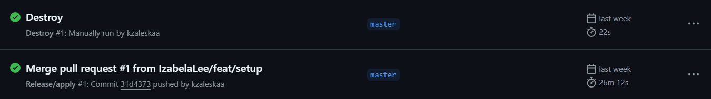
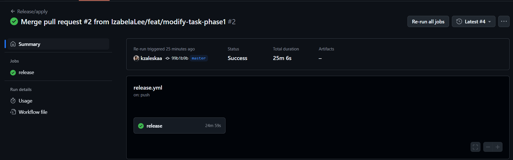
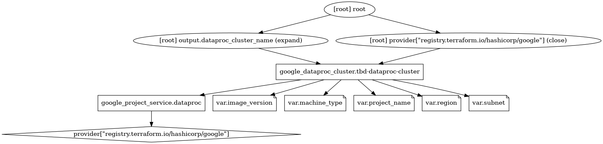
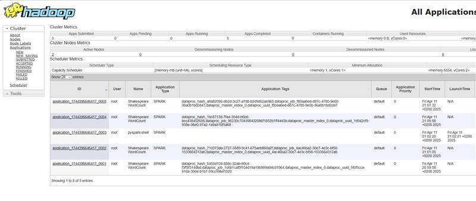
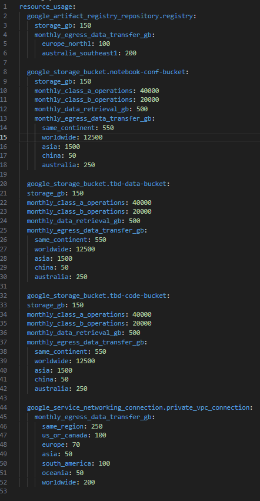
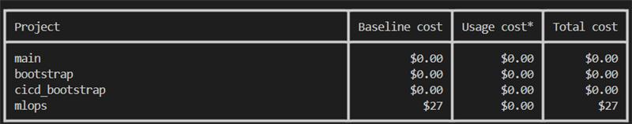
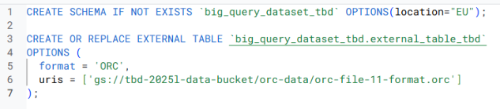
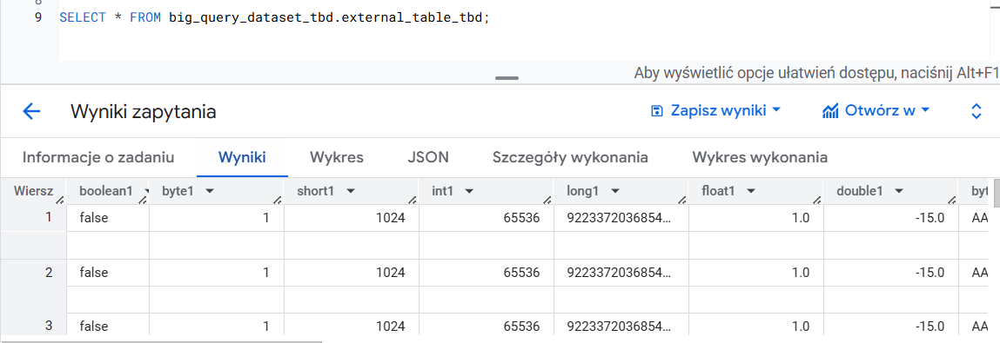
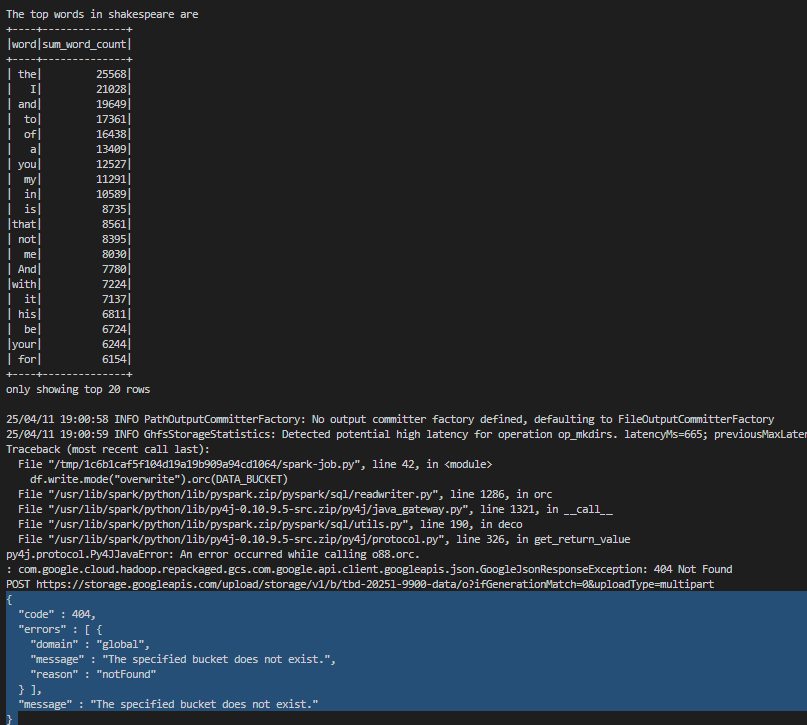
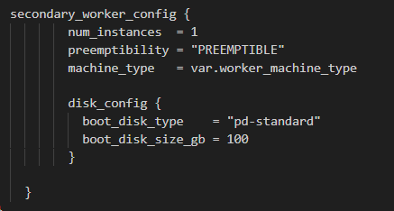

IMPORTANT ❗ ❗ ❗ Please remember to destroy all the resources after each work session. You can recreate infrastructure by creating new PR and merging it to master.
  


1. Authors:

   Izabela Lengiewicz, Katarzyna Zaleska, Katarzyna Witowska

   **Group number** - 11

   **Repository link** - https://github.com/IzabelaLee/tbd-zespol-11

2. Follow all steps in README.md.

3. In boostrap/variables.tf add your emails to variable "budget_channels".

    Modified budget_channels:
    ```
    variable "budget_channels" {
    type        = map(string)
    description = "Budget notification channels"
    default = {
        marek-wiewiorka : "marek.wiewiorka@gmail.com"
        katarzyna-zaleska : "kzaleska416@gmail.com"
        katarzyna-witowska : "katarzyna.witowska8@gmail.com"
        izabela-lengiewicz : "izabela.leng@gmail.com"
    }
    }
    ```

4. From avaialble Github Actions select and run destroy on main branch.

   

5. Create new git branch and:
    1. Modify tasks-phase1.md file.

    2. Create PR from this branch to **YOUR** master and merge it to make new release.

    Succesfull application of release:
   


6. Analyze terraform code. Play with terraform plan, terraform graph to investigate different modules.

    The chosen modules is **dataproc** located in `/modules/dataproc`.

    Input variables are used to parametrize the cluster configuration. There are:
    - `input_project_name` (required) - the GCP project where the resources will be in use.
    - `input_subnet`(required) - the VPC subnet used for cluster networking.
    - `input_image_version` (optional) - describes the Dataproc image version used for the cluster. Defaults to `2.1.27-ubuntu20`.
    - `input_machine_type` (optional) - defines the machine type for both master and worker nodes. Defaults to `e2-medium`
    - `input_region` (optional) - the GCP region where the Dataproc cluster will be deployed. Defaults to `europe-west1`.

    The modules uses two key Google Cloud resources:
    - `google_project_service.dataproc` - ensure that the Dataproc API is enabled for the project.
    - `google_dataproc_cluster.tbd-dataproc-cluster` - defines and creates the Dataproc cluster itself with configuration.

    Module has one output `dataproc_cluster_name`, which exposes the name of the created Dataproc cluster, which can be used e.g. by other modules.

    The `terraform plan` command shows the actions Terraform will take. Below is a portion of its output::
    ```
    Terraform used the selected providers to generate the following execution plan. Resource actions are indicated with the following symbols:
    + create

    Terraform will perform the following actions:

    # google_dataproc_cluster.tbd-dataproc-cluster will be created
    ...

    # google_project_service.dataproc will be created
    + resource "google_project_service" "dataproc" {
        + disable_on_destroy = true
        + id                 = (known after apply)
        + project            = "tbd-2025l-335203"
        + service            = "dataproc.googleapis.com"
        }

    Plan: 2 to add, 0 to change, 0 to destroy.

    Changes to Outputs:
    + dataproc_cluster_name = "tbd-cluster"
    ```

    Terraform graph for this module was generated using command `terraform graph -type=plan | dot -Tpng >graph.png`:
    
    Terraform uses the DOT language (graph description language). After installing Graphvix, it was possible to render a PNG image.


7. Reach YARN UI

   ```hcl
   gcloud compute ssh tbd-cluster-m --project=tbd-2025l-335203 --zone=europe-west1-d --tunnel-through-iap -- -L 8088:localhost:8088
   ```

   

8. Draw an architecture diagram (e.g. in draw.io) that includes:
    1. VPC topology with service assignment to subnets
    2. Description of the components of service accounts
    3. List of buckets for disposal
    4. Description of network communication (ports, why it is necessary to specify the host for the driver) of Apache Spark running from Vertex AI Workbech

    ***Service Account Components:***

    - Terraform Service Account (Terraform SA):
    This account allows Terraform to authenticate with the cloud provider and manage infrastructure resources. It grants Terraform the necessary permissions to create, modify, and delete cloud components.

    - Google Cloud Composer Service Account (Composer SA):
    Used by Google Cloud Composer to orchestrate workflows. This service account enables access to other Google Cloud services like Cloud Storage and BigQuery, which are essential for running DAGs and handling data processing tasks.

    - Infrastructure as Code Service Account (IaC SA):
    Utilized by infrastructure automation tools to provision and manage cloud infrastructure. In our setup, this account is used within GitHub Actions to authenticate and perform tasks such as deploying infrastructure automatically when changes are merged into the main branch.


    ***Network Communication***

    - Coordinating Resources: The driver communicates with the cluster’s master node to manage and assign resources across the workers. Clearly specifying the host makes sure this connection can happen reliably.

    - Managing Task Execution: The driver is responsible for breaking down the application into tasks and assigning them to the worker nodes. Knowing the driver's address helps streamline this process and maintain proper control over execution.


    

9. Create a new PR and add costs by entering the expected consumption into Infracost
For all the resources of type: `google_artifact_registry`, `google_storage_bucket`, `google_service_networking_connection`
create a sample usage profiles and add it to the Infracost task in CI/CD pipeline. Usage file [example](https://github.com/infracost/infracost/blob/master/infracost-usage-example.yml) 

    **Command**

    infracost breakdown --path=plan.json --usage-file=infracost-usage.yml

   **infracost-usage.yml:**

   

   **output:**

   

10. Create a BigQuery dataset and an external table using SQL
    
    **SQL Query:**

    

    **output:**

    
   
    **Why does ORC not require a table schema?**

    ORC files embed the table schema directly in their file footer, along with metadata like column types, row count, and statistics. Because of this, tools like BigQuery can automatically detect the schema when reading ORC files, removing the need to manually define it in many cases — especially when using schema autodetection.


11. Find and correct the error in spark-job.py

    Command used to run `spark-job.py`:
    ```
    gcloud dataproc jobs submit pyspark modules/data-pipeline/resources/spark-job.py --cluster=tbd-cluster --region=europe-west1
    ```

    First run of above command:

    

    The identified error was due to an incorrect bucket. After applying the fix, the line below works correctly:
    ```python
    # original line
    DATA_BUCKET = "gs://tbd-2025l-9900-data/data/shakespeare/"

    # fixed line
    DATA_BUCKET = "gs://tbd-2025l-335203-data/data/shakespeare/"
    ```

    Run finished successfully:
    

12. Add support for preemptible/spot instances in a Dataproc cluster

    ***Link to the modified file:*** https://github.com/IzabelaLee/tbd-zespol-11/blob/master/modules/dataproc/main.tf

    ***Inserted terraform code:***

     
